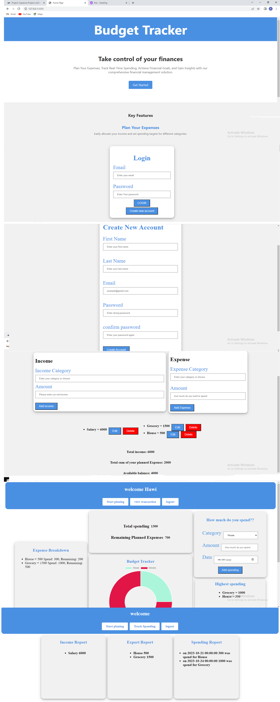

<h1>Budget Tracker</h1>
 
<h2>Project Overview:</h2>
 
The project aims to develop a budget tracking application that enables users to monitor and record their income and expenses, comparing them to their planned budget. The application will provide a user-friendly interface for inputting and categorizing financial transactions. It will also incorporate features for generating reports and visualizations to help users analyze their spending patterns and identify areas of overspending or potential savings. By accurately tracking income and expenses, the application will empower users to stay aware of their financial situation and make necessary adjustments to their spending habits ultimately helping them progress towards their financial objectives.
 
<h2>Purpose:</h2>
 
The purpose of the budget tracking application is to help users monitor and manage their income and expenses, comparing them to their planned budget. It promotes financial awareness and discipline, enabling users to make informed decisions and align their spending with their financial goals.
 
<h2>Goals:</h2>
 
1.	Develop a user-friendly interface for easy input and categorization of financial transactions.
 
2.	Enable accurate tracking of income and expenses, allowing users to stay updated on their financial activities.
 
3.	Generate insightful reports and visualizations to analyze spending patterns and identify areas of improvement.
 
4.	Offer customization options to adapt to users' specific needs and financial goals.
 
5.	Provide actionable insights and recommendations to guide users in making informed financial decisions.
 
<h2>Problem the project aims to solve:</h2>
 
1.	Many individuals struggle to effectively monitor and manage their finances, which hinders their ability to achieve their financial goals.
 
2.	Without a clear overview of their income and expenses, people find it challenging to make informed decisions about their spending habits and budgeting.
 
3.	Manual tracking of financial transactions is time-consuming and prone to errors, leading to inaccuracies in financial records.
 
4.	The lack of real-time insights and analytics makes it difficult for individuals to identify areas of overspending or potential savings.
 
5.	The absence of a streamlined system for organizing and categorizing expenses further complicates financial management.
 
<h2>Features and Functionality of the project:</h2>
 
1.	<strong>Income tracking</strong>: Users can record their income sources.
 
2.	<strong>Expense tracking</strong>: Users can easily record their expenses, allowing them to track where their money is being spent.
 
3.	<strong>Expense Categorization</strong>: Users can categorize their expenses into different predefined categories or create custom categories. This helps organize and track spending patterns.
 
4.	<strong>Budget Tracking</strong>: Users can set budget limits for different expense categories and track their spending against those limits. The application provides alerts or notifications when users approach or exceed their budget limits.
 
5.	<strong>Financial Reports</strong>: The application generates reports and visualizations, providing users with an overview of their financial activities, spending patterns, and budget performance.
 
6.	<strong>Reminders and Notifications</strong>: Users can set reminders for bill payments or receive notifications for approaching budget limits.
 
7.	<strong>Cross-Device Compatibility</strong>: The project is accessible across multiple devices, including smartphones, tablets, and computers. Users can track their finances and access their financial information seamlessly across different devices.
 
Users can interact with the application by recording their income sources and expenses, categorizing expenses, setting budget limits, and receiving alerts for budget limits and bill payments. The application generates reports and visualizations, providing users with a comprehensive overview of their financial activities and spending patterns. Notably, the application offers cross-device compatibility, allowing users to access their financial information seamlessly from smartphones, tablets, and computers. This feature ensures accessibility and convenience for users to manage their finances effectively and make informed decisions.
 
<strong>Technologies Used for the project</strong>:

 
1.	<strong>HTML</strong>: Create the structure and layout of web pages, defining necessary elements such as forms, tables, and headings to capture and display budget-related data.
 
2.	CSS: Apply styles to HTML elements to enhance the visual appearance of the app and define colors, fonts, spacing, and other design aspects, ensuring a consistent and appealing user interface.
 
3.	<strong>JavaScript</strong>: Add interactivity to the app and handle user input, perform calculations, and update the interface dynamically. For example, validate form inputs, calculate budget totals, and provide real-time feedback to users.
 
4.	<strong>Python (with Flask)</strong>: Handle the backend logic of the app, managing different URLs and connecting them with corresponding Python functions. These functions can process form submissions, retrieve or store data in the database, perform calculations, and generate reports.
 
5.	<strong>API</strong>: API component is responsible for creating endpoints that handle requests and connect with the database. It plays a crucial role in facilitating communication between the frontend and backend, enabling functionalities such as data retrieval, manipulation, and validation for budget-related operations.
 
6.	<strong>MySQL</strong>: Utilize a database management system to store and retrieve budget-related data. Create database tables to store expenses, categories, and other relevant information. Use SQL queries in Python code to interact with the database, such as inserting new expense records, retrieving budget summaries, or generating reports based on specific criteria.
 
<h2>Future plans for the project:</h2>
 
1.	<strong>Bank Statement Integration</strong>: Connect the application with users' bank accounts to import transaction data automatically.
 
2.	<strong>Scan Bill Functionality</strong>: Implement the ability to scan bills or receipts for easy expense tracking.
 
3.	<strong>Data Encryption</strong>: Enhance security and privacy by implementing robust data encryption measures.
 
4.	<strong>Performance Optimization</strong>: Improve the application's performance to ensure fast and reliable operation, even as the user base and data volume grow.
 
<strong>Flow Chart</strong>

<strong>Prototype Figma Link:</strong> https://www.figma.com/file/h6j90rRW2vDstnogAZoYE8/Budget_Tracker?type=design&node-id=0%3A1&mode=design&t=lCIRdmHHAWSWAlfG-1

 
<h2>Contact information:</h2>
	<strong>Name: Roza Alene 
	Email:rozaalene@gmail.com</strong> 
	<strong>Github:</strong> https://github.com/Rozi19 
	<strong>LinkedIn:</strong> www.linkedin.com/in/roza-alene-b3605b279 
	<strong>Tweeter:</strong> https://twitter.com/rozaalene

